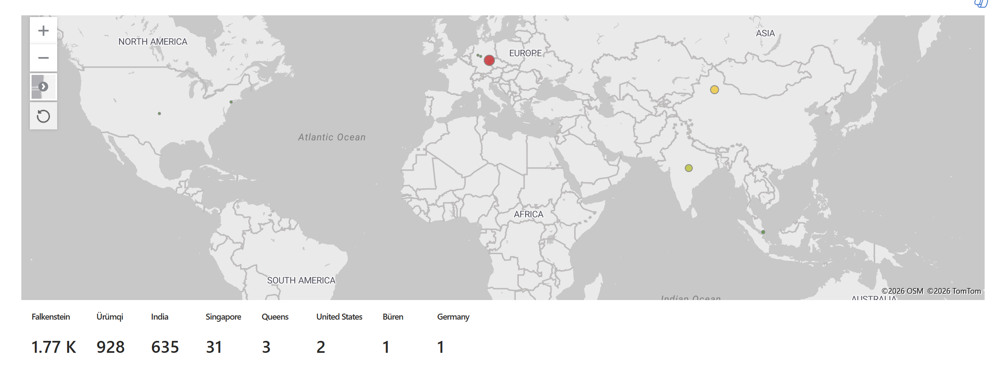

# Azure Sentinel Honeypot — Live Attack Map

A cloud honeypot that captures real internet attack traffic and plots it on a live
geographic heatmap. An intentionally-exposed Windows VM in Azure attracts brute-force
attempts from real attackers; failed logons are shipped to Microsoft Sentinel, enriched
with geolocation, and visualized on a world map colored by attack volume.

> **TL;DR** — Deployed an internet-facing Windows VM in Azure, forwarded its Security
> event logs to a Log Analytics workspace, enriched attacker IPs against a custom geoip
> watchlist, and built a Sentinel workbook heatmap showing where attacks originate —
> then triaged the alerts to separate real threats from background noise.



---

## Architecture

| Component | Role |
|-----------|------|
| Windows VM (`Admin-EAST-1`) | Exposed honeypot — NSG open to all inbound, Windows firewall off |
| Log Analytics workspace (`LAW-SOC-LAB`) | Collects the VM's Security event logs |
| Microsoft Sentinel | SIEM layer — KQL queries, watchlist enrichment, workbook map |
| GeoIP watchlist (`geoip`) | Maps attacker IP ranges to location for the map |

The VM is deliberately exposed so it receives genuine attack traffic, not simulated attacks.

---

## How It Works

1. **Exposure** — the VM's Network Security Group allows all inbound and the Windows
   firewall is disabled, so internet scanners can reach the login surface.
2. **Attack** — automated brute-force tools worldwide find the box (within hours) and
   attempt to log in, generating **Event ID 4625** (failed logon) per try.
3. **Collection** — the Log Analytics agent forwards the Security event log to `LAW-SOC-LAB`.
4. **Enrichment** — a KQL query extracts attacker source IPs and joins them against the
   geoip watchlist with `ipv4_lookup`, resolving each to a city/country and coordinates.
5. **Visualization** — a Sentinel workbook renders the enriched data as a heatmap, sized
   and colored by attempts per location.

---

## Repo Contents

```
.
├── README.md
├── queries/
│   ├── 01-failed-logons.kql       # raw 4625 failed logons (anonymous noise filtered)
│   ├── 02-bruteforce-by-ip.kql    # attempts per source IP, with time window
│   ├── 03-geoip-enrichment.kql    # the geoip join that feeds the map
│   └── 04-investigate-4624.kql    # triage query for successful logons
├── workbook/
│   └── attack-map-workbook.json   # Sentinel workbook heatmap (paste into Advanced Editor)
├── watchlist/
│   ├── README.md                  # how the geoip watchlist was built + the size tradeoff
│   └── geoip-city-portal.csv      # summarized geoip watchlist (~2.6 MB, portal-uploadable)
└── screenshots/
    └── attack-map.png             # the finished heatmap (add your own)
```

---

## The Detection Query

Full version in [`queries/03-geoip-enrichment.kql`](queries/03-geoip-enrichment.kql):

```kql
let GeoIPDB = _GetWatchlist("geoip");
SecurityEvent
| where EventID == 4625
| where Account !contains "ANONYMOUS"
| where IpAddress != "-"
| where IpAddress != "REDACTED_MY_IP"     // exclude my own test logins (real value kept private)
| evaluate ipv4_lookup(GeoIPDB, IpAddress, network)
| extend latitude  = toreal(latitude), longitude = toreal(longitude)
| extend city_name = iff(isempty(city_name), country_name, city_name)
| summarize Attempts = count() by IpAddress, city_name, country_name, latitude, longitude
| order by Attempts desc
```

Key details:
- **`toreal()` on the coordinates** — watchlist values arrive as strings; the map won't
  plot them until they're numbers. (This was the cause of an early blank map.)
- **`!contains "ANONYMOUS"`** — filters out anonymous-logon noise (see Triage below).
- **city fallback** — `/16` blocks that resolve to country-only get the country name as a
  label instead of a blank.
- **redacted personal IP** — the filter technique is documented; the real value is kept
  out of the public repo.

---

## The GeoIP Watchlist — an Engineering Tradeoff

Sentinel portal watchlists are capped at **3.8 MB**, but a full city-level IPv4 geo
database is ~191–245 MB. Rather than take the more involved Azure Storage + SAS-URL path,
I summarized the MaxMind GeoLite2 City dataset to **one dominant location per /16 block** —
keeping full IPv4 coverage and city labels while collapsing to ~56k rows (~2.6 MB), which
fits the simple portal upload.

**Tradeoff:** `/16` granularity attributes each block to its dominant city, so boundary
IPs may map to the largest nearby city rather than their exact one. For a brute-force
**origin** map, broad geographic spread matters more than pinpoint accuracy. Details in
[`watchlist/README.md`](watchlist/README.md).

---

## Triage — Reading the Alerts

Catching events is half the job; interpreting them is the other half.

**Successful logons (4624) — investigated, benign.**
Two source IPs produced `4624` (successful logon) events — `35.233.69.31` (Google Cloud)
and `91.134.5.177` — which initially look alarming. Checking the details
([`queries/04-investigate-4624.kql`](queries/04-investigate-4624.kql)) showed both were
`ANONYMOUS LOGON`, Logon Type 3 (Network) — null-session SMB negotiations that log as
"success" at the protocol level but grant no real access. This is background noise on any
internet-facing host, distinct from a credentialed compromise (which would show a **real
account** + Logon Type **10**). Notably, `35.233.69.31` is VirusTotal-flagged as malicious,
yet its logon event was still benign — a flagged *source* doesn't make every *event* from
it a compromise. No action required.

**Brute-force source IP (4625) — failed, corroborated.**
The brute-force attempt traced to a hosting/datacenter provider, not a residential connection:

| IP | GeoIP | Provider | VirusTotal |
|----|-------|----------|------------|
| `46.4.79.170` | Germany | Hetzner (AS24940) | Flagged malicious by GreyNoise |

**This attempt never got in** — it produced only failed logons (4625), never a successful
authentication. The only successful logons observed were the benign `ANONYMOUS LOGON`
events described above.

This pattern — attacks routed through rented cloud infrastructure — is typical of
automated brute-force botnets, and a reminder that **geoip reflects IP registration, not
the operator's physical location**. My own connection geolocating to a distant city
(before I refined the watchlist) proved the point firsthand.

---

## What I Learned

- Building an end-to-end pipeline: exposed endpoint → log forwarding → SIEM → enrichment
  → visualization.
- Writing KQL joins with `ipv4_lookup` against a watchlist.
- Working within real service limits (the 3.8 MB watchlist cap) and making a deliberate
  data-summarization tradeoff to stay inside them.
- SOC triage judgment: distinguishing benign anonymous logons from real compromise by
  reading account, logon type, and source IP — not reacting to the event code alone.
- That geolocation is an *indicator*, not attribution.

---

## What I'd Do Next

- Add Sysmon for richer process-level telemetry.
- Write a scheduled analytics rule to alert on brute-force thresholds automatically.
- Enrich attacker IPs against VirusTotal / AbuseIPDB via a Logic App playbook.
- Add an active-response step to block source IPs after N failures.
- Map detections to MITRE ATT&CK (RDP brute force = T1110.001).

---

## Cost & Safety Notes

- The VM is **deallocated when not actively collecting** — an exposed VM billing 24/7 and
  running unattended is both a cost and a security risk.
- A budget alert catches any runaway spend.
- The honeypot uses a strong, unique admin credential — an exposed box with a weak password
  stops being a honeypot and becomes a real compromise.
- Screenshots are scrubbed of personal IP, subscription ID, and account email before committing.
